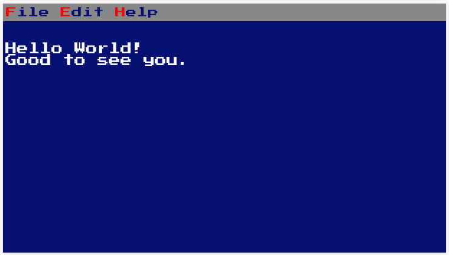
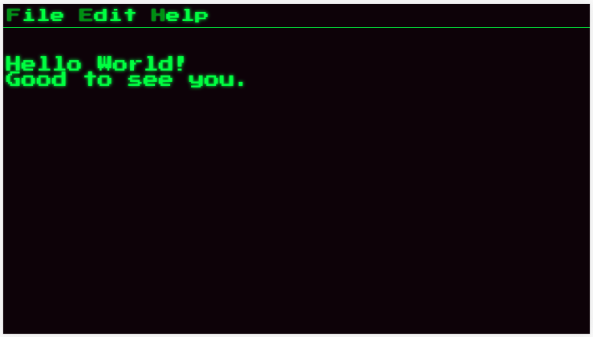
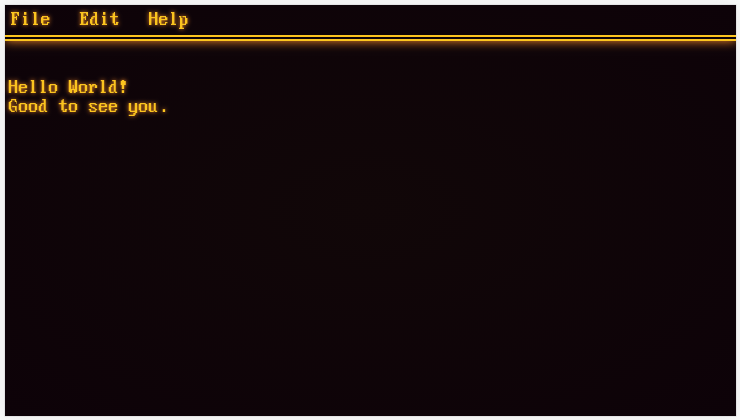

# Old Terminal

An old terminal HTML/JS/CSS template I've been working on. [Live version](https://victorribeiro.com/oldTerminal)







## Documentation

Changing font to 'Px Plus VGA Square Px'.
```html
<link rel="stylesheet" type="text/css" href="css/PxPlusVGASquarePx.css" />
```

Changing font to 'Press Start 2P'.
```html
<link rel="stylesheet" type="text/css" href="css/PressStart2P.css" />
```

Chaging color style to green on black.
```html
<link rel="stylesheet" type="text/css" href="css/green_on_black.css" />
```

Chaging color style to white on blue.
```html
<link rel="stylesheet" type="text/css" href="css/white_on_blue.css" />
```

Chaging color style to orange on black.
```html
<link rel="stylesheet" type="text/css" href="css/orange_on_black.css" />
```

Creating a menu bar.
```html
<div id="menu_bar"></div>
```

Defining where the text will show.
```html
<div id="main_content"></div>
```

Adding items to the menu bar.
```html
<div id="menu_bar">
  
  <div id="file" class="menu">
    <!-- Title //-->
    <span class="menu_item">File</span> 
    <div id="file_content" class="content">
      <ul>
        <!-- Sub Menus //-->
        <li id="init"><span> Init </span></li> 
        <li id="file1"><span> File 1 </span></li>
        <li id="file2"><span> File 2 </span></li>
      </ul>
    </div>
  </div>
  
</div>
```

Adding content to the menu item .
```html
<div id="init_page" class="page">
<p>Hello World!</p>
<p>Good to see you.</p>
</div>

<div id="file1_page" class="page">
<p>Lorem ipsum dolor sit amet, consectetur adipiscing elit.</p>
<p>Integer nec odio. Praesent libero.</p>
</div>

<div id="file2_page" class="page">
<p>Praesent mauris. Fusce nec tellus sed augue semper porta.</p>
<p>Mauris massa. Vestibulum lacinia arcu eget nulla.</p>
</div>
```
